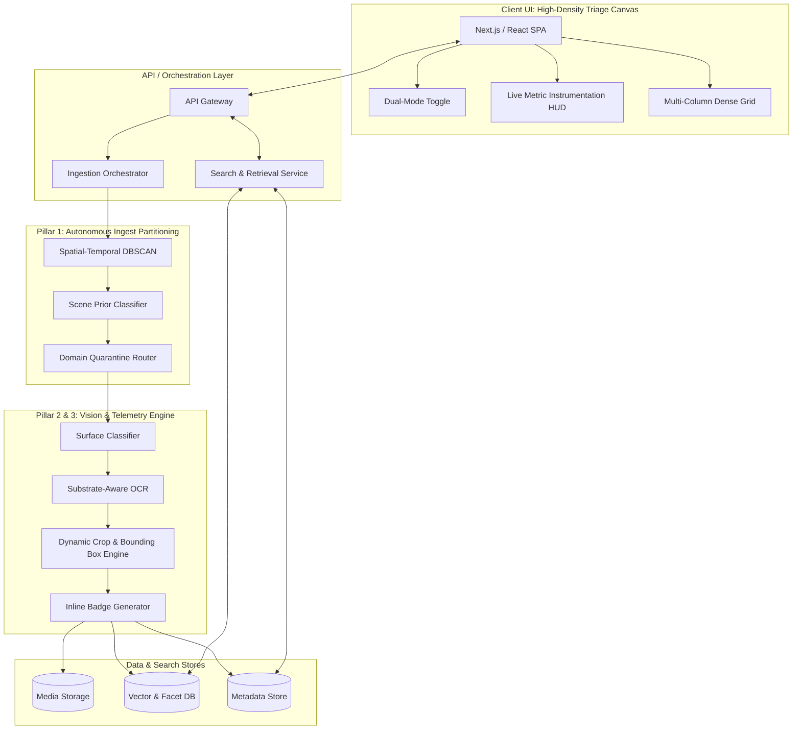

# Architecture Document: Anti-Gravity MVP Engine ("Evidence Lens")

This document outlines the technical architecture for the **Anti-Gravity MVP Engine**, specifically focusing on the "Evidence Lens" feature (SiteLens Core) as detailed in the problem statement. 

---

## 1. System Overview

The Anti-Gravity MVP Engine is designed to transition a passive cloud gallery into a high-density, zero-latency physical evidence audit engine. The system addresses critical friction points experienced by field professionals by introducing domain quarantine, substrate-aware OCR, dynamic cropping, and a dense multi-column UI tailored for instantaneous retrieval without conversational chat overhead.

## 2. High-Level Architecture Diagram

---

## 3. Core Subsystems

### 3.1. Frontend Application (Pillar 4: High-Density Triage Canvas)
The UI focuses on telegraphic multimodal inputs rather than conversational prose, optimizing for maximum viewport utility on mobile and desktop.
* **Framework:** Next.js (React) or Streamlit. Next.js is recommended to achieve the sub-100ms rendering requirement.
* **Dual-Mode Toggle Engine:**
  * **Mode A (Legacy):** Simulates standard horizontal carousel, 6-8s latency, and conversational prose.
  * **Mode B (Evidence Lens):** Triggers the instant partition filter and renders dynamically cropped thumbnails.
* **Layout Structure:** 3-to-4 column dense vertical scroll grid with persistent scroll indexing (prevents scroll position reset upon exiting a full-screen image view).
* **Live Instrumentation HUD:** Real-time dashboards overlaying Retrieval Time (<3.0s), Domain Contamination Rate (target 0%), and Clicks to Verification.

### 3.2. Autonomous Ingest Partitioning (Pillar 1)
Responsible for isolating high-entropy professional utility captures from personal domestic media.
* **Spatial-Temporal Clustering:** Utilizes the DBSCAN algorithm to cluster metadata (timestamp, GPS coordinates) and detect unmapped commercial or job-site micro-radii.
* **Scene Prior Models:** A lightweight classification model that flags architectural context (e.g., exposed rebar, scaffolding, masonry).
* **Quarantine Router:** Partitions indexed images into a strict "Evidence / Site Stream," ensuring 0% contamination of personal photos in professional query results.

### 3.3. Substrate-Aware Visual OCR (Pillar 2)
Handles the non-planar, low-fidelity text detection that traditional OCR fails to index.
* **Surface Classification:** Categorizes the image substrate (e.g., Rough Stone, Wire-Cut Brick, A4 Document / Seal, Timber Frame) to establish a facet filter.
* **Texture & Marker Tuning OCR:** Specialized Vision-Language Models (e.g., fine-tuned Florence-2, TrOCR) trained to extract:
  * Red/black wax grease pencil on stone/brick.
  * Spray paint and chalk on formwork.
  * Dot-matrix printing and blue circular stamps.

### 3.4. Dynamic Telemetry & Cropping (Pillar 3)
Eliminates "thumbnail blindness" by centering visual evidence directly in the grid view.
* **Attention-Crop Generator:** Translates the OCR bounding boxes into localized crop coordinates to center the thumbnail directly on the evidence (e.g., LOT-GR-408 marking) instead of a wide shot.
* **Inline Verification Badges:** Overlays extracted alphanumeric tokens directly on the thumbnail as high-contrast pills, pushing the "Clicks to Verification" metric to 0.

---

## 4. Data Flow

### 4.1. Media Ingestion
1. **Upload:** User captures an image; the payload and EXIF data are pushed to the backend.
2. **Quarantine Phase:** DBSCAN and Scene Prior classifiers determine if the image belongs to the "Site Stream".
3. **Processing Phase:** If classified as Evidence, the image is passed to the Vision pipeline.
4. **Extraction:** Surface classification and non-planar OCR extract features and text bounding boxes.
5. **Storage:** Cropped thumbnails, original blobs, text tokens, and surface facets are written to the Vector DB/Metadata Store.

### 4.2. Search & Retrieval
1. **Query Input:** User provides a token (e.g., `OFFSET 150mm`) or reference material.
2. **Filtering:** The Search Service strictly scopes the query to the Evidence Partition.
3. **Fetch & Render:** Results are returned in <100ms. The UI requests the Attention-Cropped thumbnails and injects the corresponding Inline Verification Badges.

---

## 5. Technology Stack Recommendations

| Layer | Recommended Technology | Rationale |
| :--- | :--- | :--- |
| **Frontend UI** | Next.js / React | Required for sub-100ms response, optimized asset loading, and complex grid state management. |
| **Backend API** | Node.js (Express/Fastify) or Python (FastAPI) | High-concurrency routing and fast interaction with ML microservices. |
| **Machine Learning / OCR** | Python (PyTorch), fine-tuned VLM (Florence-2 / TrOCR), OpenCV | Essential for handling substrate classification and non-planar handwriting extraction. |
| **Clustering Engine** | Scikit-Learn (DBSCAN) | Industry standard, robust for spatial-temporal data clustering. |
| **Database / Search** | PostgreSQL + pgvector OR Pinecone / Milvus | Efficient vector search capabilities and facet filtering for material types and locations. |
| **Media Storage** | AWS S3 / Google Cloud Storage | Highly scalable, low-latency blob storage for original media and cropped thumbnails. |
